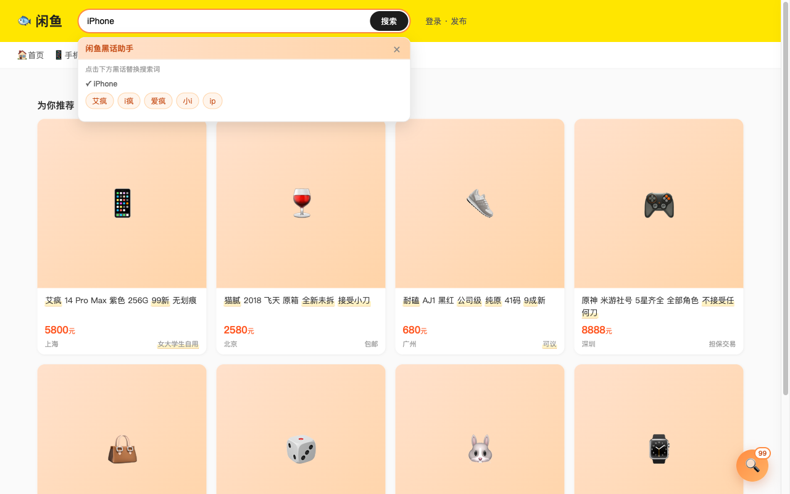
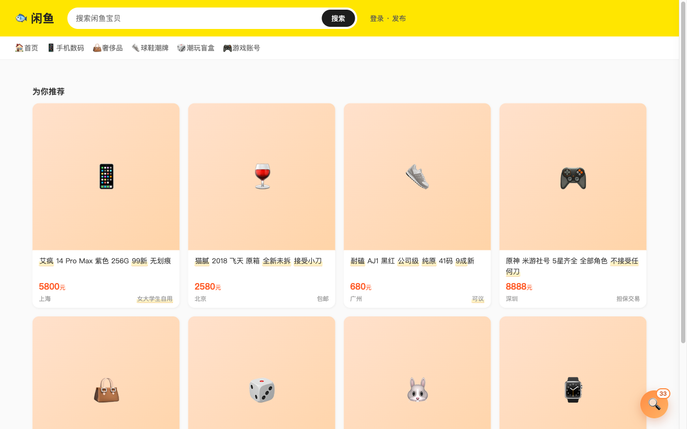
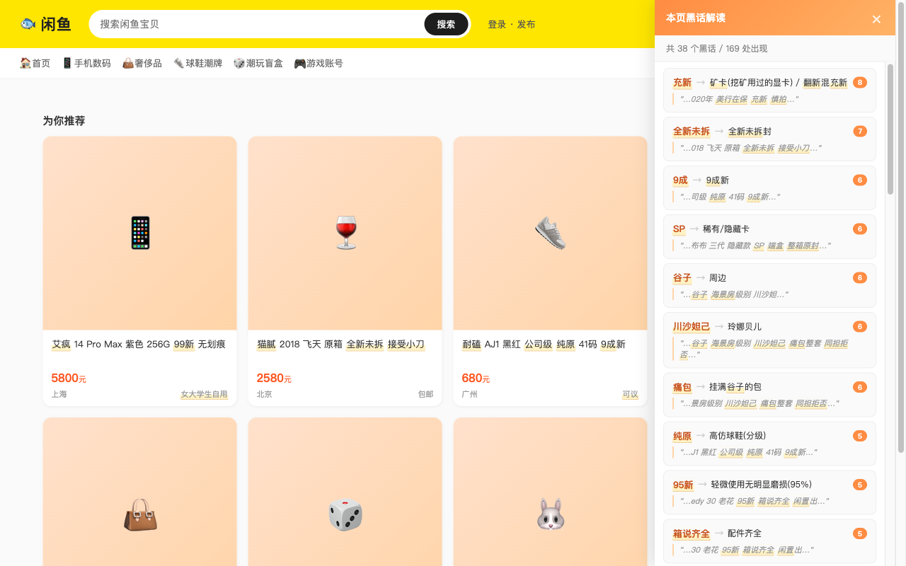
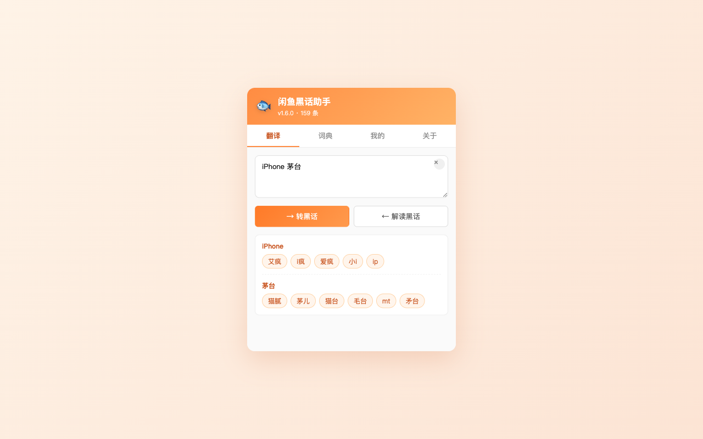
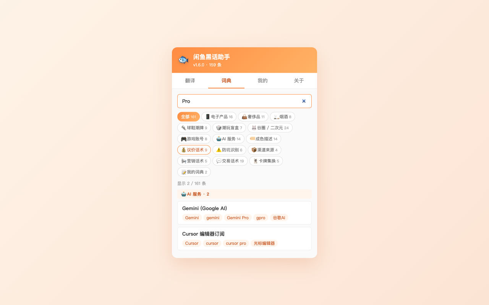

# 🐟 闲鱼词典

> Chrome 浏览器扩展 · 一秒读懂闲鱼卖家的隐讳用语 · 完全本地运行 · 零数据收集

## 它解决什么问题？

闲鱼上很多卖家使用谐音、缩写、绰号规避平台关键词过滤，普通买家**搜不到**目标，**看不懂**描述。

| 你能看懂吗？ | 实际是？ |
|---|---|
| **艾疯** 14 Pro Max | iPhone 14 Pro Max |
| **猫腻** 2018 飞天 | 茅台 2018 飞天 |
| **驴牌** Speedy 30 | LV (路易威登) |
| **拉布布** 三代 隐藏款 | Labubu 三代 |
| **耐磕** AJ1 黑红 公司级 | Nike AJ1 黑红高仿 |
| 接受 **小刀** | 接受小幅度议价 (7-8 折) |
| **9 成 9 新** 包**邮** | 接近全新，卖家承担运费 |
| **女大学生自用** | （警示信号：可能是矿卡 / 翻新货） |

本扩展用一份精心整理的词典——**15 分类 · 159 词条 · 489 个变体**——一次性解决。

---

## 核心功能

### 🔍 搜索时自动建议暗语

在闲鱼搜索框输入正常词（如 `iPhone`），自动弹出对应暗语推荐（`艾疯/i疯/爱疯`），点击直接替换搜索词。

### ✨ 浏览商品时自动解读

商品标题和描述里的暗语会自动加下划线高亮。鼠标悬停就显示真实含义。

### 📋 一键查看本页全部暗语

右下角浮动按钮显示本页检测到的暗语数量。点击展开侧滑面板，按出现频次排列，**点击条目可定位到第一次出现的位置**。

### 💬 独立翻译面板

点击工具栏图标，弹窗里可以做双向翻译：

- **正向**（→ 转暗语）：输入"iPhone 茅台"，得到所有暗语变体
- **反向**（← 解读暗语）：粘贴商品描述，自动标出所有暗语

### 📝 自定义词典（本地）

发现新暗语？在"我的"标签自己加。

- 增 / 删 / 改 / JSON 导入导出
- 与内置词典视觉区分（**蓝色** vs 内置橙色）
- 数据**永不上传**，只存你的浏览器

### 📚 完整词典浏览

15 个分类 chip 一键筛选，支持词条 / 变体双向全文搜索。

### 🤖 可选本地 AI 兜底

词典查不到？一键调用 Chrome 内置的 **Gemini Nano**（完全在你设备上运行），让 AI 帮你推测。

- **opt-in** — 必须用户点按钮才触发
- **完全本地** — 不联网、不外发
- 推测结果带"AI 推测"标签，准确度低于词典

---

## 词典分类一览

| 分类 | 词条数 | 示例 |
|---|---|---|
| 📱 电子产品 | 16 | 艾疯 / 卑果 / 花为 / 大米 / 矿卡 |
| 👜 奢侈品 | 11 | 驴牌 / 香奶奶 / 爱马屎 / 老鼠 / 绿水鬼 |
| 🚬 烟酒 | 8 | 猫腻 / 仲华 / 拉飞 |
| 👟 球鞋潮牌 | 9 | 耐磕 / 椰子 / 通货 / 纯原 / 公司级 |
| 🎲 潮玩盲盒 | 7 | 拉布布 / 川沙妲己 / 端盒 |
| 🐰 谷圈 / 二次元 | 23 | 谷子 / 吧唧 / 痛包 / 海景房 / 同担拒否 |
| 🎮 游戏账号 | 8 | 农药 / 原批 / 吃鸡 |
| 🤖 AI 服务 | 14 | 拟人 / 拼车 / 中转站 / 学生认证 |
| 🏷️ 成色描述 | 14 | 99 新 / 伊拉克成色 / 充新 / 战损 |
| 💰 议价话术 | 9 | 不接受任何刀 / 小刀 / 屠龙刀 |
| ⚠️ 防坑识别 | 6 | 女大学生自用 / 只面交 / 国行在保 |
| 📦 渠道来源 | 4 | 年会奖品 / 水货代购 |
| 📢 营销话术 | 5 | 白菜价 / 急出 / 清仓 |
| 💬 交易话术 | 16 | 走闲鱼 / 秒拍 / 十动然鱼 |
| 🃏 卡牌集换 | 5 | 端盒 / 散包 / SP |

---

## 安装

### 方式 1：Chrome 应用商店（推荐，审核中）

待发布。

### 方式 2：手动加载（开发者模式）

1. 到 [Releases 页面](https://github.com/sudoo-dev/xianyu-slang-helper/releases) 下载最新 `.zip`
2. 解压到任意文件夹
3. Chrome 地址栏访问 `chrome://extensions/`
4. 右上角开启"**开发者模式**"
5. 点击"**加载已解压的扩展程序**"，选刚才的文件夹
6. 访问 [goofish.com](https://www.goofish.com/) 即可使用

> 兼容 Chrome 138+ / Edge / Brave 等 Chromium 内核浏览器

---

## 隐私

| 项 | 说明 |
|---|---|
| 外部请求 | 🚫 **零**（无任何 fetch / XHR / WebSocket） |
| 数据收集 | 🚫 **零**（无统计、无埋点、无第三方 SDK） |
| 同步存储 | 🚫 **不使用** chrome.storage.sync |
| 本地存储 | ✅ 仅你的偏好设置和自定义词条（chrome.storage.local，永不外发） |
| 生效域名 | ✅ 仅 `goofish.com / xianyu.com / 2.taobao.com`，其它网站完全不工作 |

完整说明：[隐私政策](privacy/)

---

## 开源

源代码、构建脚本、明文词典完全开源：

[github.com/sudoo-dev/xianyu-slang-helper](https://github.com/sudoo-dev/xianyu-slang-helper)

License: MIT

## 反馈与贡献

- 词典遗漏 / 误报 / Bug：[GitHub Issues](https://github.com/sudoo-dev/xianyu-slang-helper/issues)
- 邮箱：[help@sudoo.dev](mailto:help@sudoo.dev)

欢迎 PR 补充新词条！编辑 [tools/dictionary.source.json](https://github.com/sudoo-dev/xianyu-slang-helper/blob/main/tools/dictionary.source.json) 即可。
